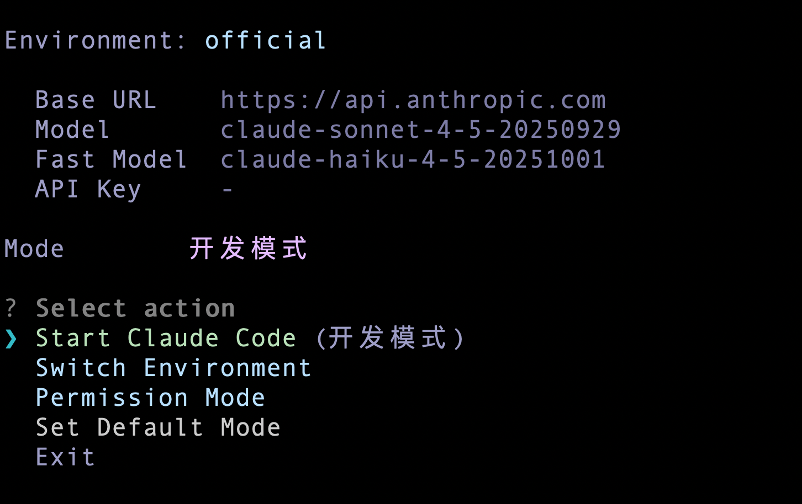

# Claude Code Env Manager

优雅的使用 Claude Code 🍷

切换 API 服务商、配置权限模式、查看用量统计、安装 Skills。

[](https://www.npmjs.com/package/ccem)
[](https://github.com/genuifx/claude-code-env-manager/blob/main/LICENSE)



## 这工具干嘛的

用 Claude Code 的人可能会遇到几个烦心事：

- 想用国产模型（GLM、KIMI、DeepSeek、MiniMax）但每次都要手动设置环境变量
- 每次执行命令都要点"允许"，烦死了，但又不想用 `--dangerously-skip-permissions`
- 想知道这个月花了多少钱，但 Claude 没有用量统计界面
- 团队想共享 API 配置，但不想把密钥明文传来传去
- 想快速安装官方和社区的 Skills，但手动 clone 太麻烦

ccem 就是解决这些问题的。

## 功能特性

- 🔄 **环境切换** - 一键切换 API 服务商（官方/GLM/KIMI/DeepSeek/MiniMax）
- 🔐 **权限管理** - 6 种预设权限模式，在安全和便捷之间找平衡
- 📊 **用量统计** - 日历热力图 + 按模型统计 + 费用计算
- 🛠️ **Skill 管理** - 从官方/GitHub/Plugin Marketplace 安装 Skills
- 🌐 **远程配置** - 团队共享 API 配置，加密传输
- ⚡ **性能优化** - 增量缓存、流式解析、后台更新

## 安装

```bash
npm install -g ccem
# 或
pnpm add -g ccem
# 或直接跑
npx ccem
```

## 快速上手

```bash
ccem              # 进入交互菜单
ccem add kimi     # 添加 KIMI 环境，自动填好 URL 和模型
ccem use kimi     # 切换到 KIMI
ccem dev          # 用开发模式启动 Claude Code（临时）
ccem --mode       # 查看当前权限模式
```


---

## 环境管理

### 交互菜单

运行 `ccem` 会看到一个菜单：

| 选项 | 干嘛用 |
|------|--------|
| Start Claude Code | 启动，如果设了默认权限模式会自动带上 |
| Switch Environment | 切换 API 环境 |
| Permission Mode | 选个权限模式再启动 |
| View Usage | 看用量和花费（带日历热力图） |
| Set Default Mode | 设置默认权限模式 |

### 命令

```bash
ccem ls              # 列出所有环境
ccem use <name>      # 切换环境
ccem add <name>      # 添加环境
ccem del <name>      # 删除环境（official 删不掉）
ccem current         # 当前用的哪个环境
ccem env             # 输出 export 命令，配合 eval 用
ccem env --json      # 输出 JSON
ccem run <command>   # 带着环境变量跑命令
```

### 内置预设

添加环境时可以选预设，省得自己填 URL：

| 预设 | Base URL | 主模型 | 快速模型 |
|------|----------|--------|----------|
| GLM（智谱） | `https://open.bigmodel.cn/api/anthropic` | glm-4.6 | glm-4.5-air |
| KIMI（月之暗面） | `https://api.moonshot.cn/anthropic` | kimi-k2-thinking-turbo | kimi-k2-turbo-preview |
| MiniMax | `https://api.minimaxi.com/anthropic` | MiniMax-M2 | MiniMax-M2 |
| DeepSeek | `https://api.deepseek.com/anthropic` | deepseek-chat | deepseek-chat |

> 💡 **官方环境**：默认使用 `claude-sonnet-4-5-20250929` 和 `claude-haiku-4-5-20251001`

### Shell 集成

`ccem use` 切换环境后，当前终端的环境变量不会自动更新。加这段到 `~/.zshrc` 或 `~/.bashrc`：

```bash
ccem() {
  command ccem "$@"
  local exit_code=$?
  if [[ $exit_code -eq 0 ]]; then
    if [[ "$1" == "use" || -z "$1" ]]; then
      eval "$(command ccem env)"
    fi
  fi
  return $exit_code
}
```

加完跑一下 `source ~/.zshrc`。

---

## 权限模式

Claude Code 默认每个操作都要确认。用 `--dangerously-skip-permissions` 又太放飞。ccem 提供 6 种预设，在"什么都要确认"和"什么都不管"之间找个平衡。

### 6 种模式

| 模式 | 图标 | 说明 | 什么时候用 |
|------|------|------|------------|
| yolo | 🔓 | 全部放开 | 自己的项目，完全信任 |
| dev | 💻 | 开发常用权限，屏蔽敏感文件 | 日常开发 |
| readonly | 👀 | 只能读不能改 | 看代码、学习 |
| safe | 🛡️ | 限制网络和修改 | 不熟悉的代码库 |
| ci | 🔧 | CI/CD 用 | 自动化流程 |
| audit | 🔍 | 只读 + 搜索 | 安全审计 |

### 临时模式

退出就还原，不改配置文件：

```bash
ccem yolo      # 放飞
ccem dev       # 开发
ccem readonly  # 只读
ccem safe      # 安全
ccem ci        # CI
ccem audit     # 审计
```

实现方式是通过 `--permission-mode`、`--allowedTools` 和 `--disallowedTools` 参数传给 Claude Code。

### 永久模式

写到 `.claude/settings.json`，下次启动还生效：

```bash
ccem setup perms --yolo
ccem setup perms --dev
ccem setup perms --readonly
ccem setup perms --safe
ccem setup perms --ci
ccem setup perms --audit
ccem setup perms --reset     # 恢复默认
```

### 默认模式

设了默认模式后，交互菜单里点 "Start Claude Code" 会自动用这个模式：

```bash
ccem setup default-mode --dev    # 默认用开发模式
ccem setup default-mode --reset  # 清掉默认设置
ccem setup default-mode          # 看当前默认是啥
```

### 查看当前权限

```bash
ccem --mode        # 当前用的什么模式
ccem --list-modes  # 列出所有模式
```

### 权限细节

<details>
<summary><b>dev 模式具体允许/禁止什么</b></summary>

**允许：**
- 文件：Read、Edit、Write、Glob、Grep、LSP、NotebookEdit
- 开发工具：npm、pnpm、yarn、bun、node、npx、git、tsc、tsx
- 质量工具：eslint、prettier、jest、vitest
- 其他：cargo、python、pip、go、make、cmake
- 常用命令：ls、cat、head、tail、find、wc、mkdir、cp、mv、touch
- WebSearch

**禁止：**
- 敏感文件：.env、.env.*、secrets/、*.pem、*.key、*credential*
- 危险命令：rm -rf、sudo、chmod、chown

</details>

<details>
<summary><b>safe 模式具体允许/禁止什么</b></summary>

**允许：**
- 只读：Read、Glob、Grep、LSP
- Git 查看：git status、git log、git diff
- 文件查看：ls、cat、head、tail、find、wc

**禁止：**
- 敏感文件：.env、secrets/、*.pem、*.key、*credential*、*password*
- 修改：Edit、Write、NotebookEdit
- 网络：curl、wget、ssh、scp、WebFetch
- 文件操作：rm、mv

</details>

---

## 用量统计

ccem 会读 Claude Code 的日志（在 `~/.claude/projects/` 下面的 JSONL 文件），统计 token 用量和费用。

价格数据从 LiteLLM 的 GitHub 仓库拉取，会缓存到本地。如果网络不可用，会依次尝试：
1. 本地缓存（`~/.ccem/model-prices.json`）
2. 内置价格文件（随 ccem 安装）
3. 默认价格（Claude Opus/Sonnet/Haiku）

交互菜单里选 "View Usage" 可以看详细统计，包括**日历热力图**：

```
  Token Usage Statistics
────────────────────────────────────────────────────────
     Oct     Nov     Dec     Jan
Mon  ·  ░  ▒  ▓  █  ░  ·  ▒  ...
Tue  ░  ▒  ·  █  ▓  ░  ▒  ·  ...
Wed  ▒  ▓  █  ░  ·  ▒  ▓  █  ...
...

     Less · ░ ▒ ▓ █  More

────────────────────────────────────────────────────────
  Period      Input    Output   Cache Read   Cost
  Today       12.5K    8.2K     45.3K        $0.15
  This Week   89.2K    52.1K    312.4K       $1.23
  All Time    1.2M     823.5K   4.5M         $15.67

────────────────────────────────────────────────────────
  By Model
  claude-sonnet-4-5    823.5K    $12.34
  claude-haiku-4-5     412.3K    $3.33
```

### 性能优化

- **增量缓存**：日志解析结果缓存到 `~/.ccem/usage-cache.json`，只解析新增/修改的文件
- **后台更新**：打开菜单时先显示缓存数据，后台异步更新
- **流式解析**：大文件使用流式读取（readline），避免内存占用过高
- **并发控制**：限制并发解析数量（5 个），避免阻塞事件循环
- **缓存版本**：缓存结构变更时自动失效重建

---

## Skill 管理

可以从 GitHub 或 Plugin Marketplace 安装 Claude Code 的 Skills。装完会放到当前目录的 `.claude/skills/` 下面。

```bash
ccem skill add              # 交互选择（Tab 切换分组）
ccem skill add <name>       # 装预设的
ccem skill add <github-url> # 从 GitHub 装
ccem skill ls               # 列出已装的
ccem skill rm <name>        # 删掉
```

### 交互式选择器

运行 `ccem skill add` 会打开分组选择界面（使用 Ink 渲染）：

```
 🏢 官方   ⭐ 精选   📦 其他 

──────────────────────────────────────────────────
❯ frontend-design - 创建高质量前端界面设计
  skill-creator - 创建新的 Claude Code skills
  web-artifacts-builder - 构建可交互的 Web 组件
  ...
  输入自定义 GitHub URL

Tab 切换分组 | ↑↓ 选择 | Enter 确认 | Esc 取消
```

### 安装方式

ccem 支持三种安装方式：

| 类型 | 说明 | 示例 |
|------|------|------|
| preset | 官方预设，从 anthropics/skills 仓库安装 | `ccem skill add frontend-design` |
| github | 从任意 GitHub 仓库/子目录安装 | `ccem skill add owner/repo` |
| plugin | 从 Plugin Marketplace 安装（实验性） | 通过交互菜单选择 |

### 预设列表

#### 🏢 官方 Skills

| Skill | 干嘛用 |
|-------|--------|
| frontend-design | 前端界面设计 |
| skill-creator | 创建新 skill |
| web-artifacts-builder | 做可交互的 Web 组件 |
| canvas-design | Canvas 绘图 |
| algorithmic-art | 算法艺术 |
| theme-factory | 做 UI 主题 |
| mcp-builder | 做 MCP 服务器 |
| webapp-testing | Web 应用测试 |
| pdf | 处理 PDF |
| docx | 处理 Word |
| pptx | 处理 PPT |
| xlsx | 处理 Excel |
| brand-guidelines | 品牌指南 |
| doc-coauthoring | 文档协作 |
| internal-comms | 内部通信文档 |
| slack-gif-creator | 做 Slack GIF |

#### ⭐ 精选 Skills

| Skill | 干嘛用 |
|-------|--------|
| superpowers | Claude Code Plan 模式升级版，连续追问讨论确定开发方案 |
| ui-ux-pro-max | 专业 UI/UX 设计 |
| Humanizer-zh | 去除文本中 AI 生成痕迹，改写得更自然 |

#### 📦 其他 Skills

| Skill | 干嘛用 |
|-------|--------|
| skill-writer | 指导用户为 Claude Code 创建代理技能 |

### 从 GitHub 装

支持多种 URL 格式：

```bash
# 完整 URL
ccem skill add https://github.com/owner/repo
ccem skill add https://github.com/owner/repo/tree/main/path/to/skill

# 简写格式
ccem skill add owner/repo
```

> 💡 使用 git sparse-checkout 只下载指定目录，不会 clone 整个仓库

---

## 远程配置加载

团队可以部署一个配置服务器，成员用 `ccem load` 命令拉取共享的环境配置。

### 客户端使用

```bash
ccem load https://your-server.com/api/env?key=YOUR_KEY --secret YOUR_SECRET
```

- `key`：服务器分配的访问密钥
- `secret`：服务器启动时生成的解密密钥

加载成功后，环境会自动添加到本地配置。如果名称冲突，会自动重命名（如 `kimi` → `kimi-remote`）。

### 服务端部署

服务端代码在 `server/` 目录下。

#### 1. 配置文件

**keys.json** - 访问密钥配置：
```json
{
  "team-key-abc123": {
    "environments": ["kimi", "glm"]
  },
  "personal-key-xyz": {
    "environments": ["deepseek"]
  }
}
```

**environments.json** - 环境配置：
```json
{
  "kimi": {
    "ANTHROPIC_BASE_URL": "https://api.moonshot.cn/anthropic",
    "ANTHROPIC_API_KEY": "sk-xxx",
    "ANTHROPIC_MODEL": "kimi-k2-thinking-turbo"
  },
  "glm": {
    "ANTHROPIC_BASE_URL": "https://open.bigmodel.cn/api/anthropic",
    "ANTHROPIC_API_KEY": "xxx.xxx",
    "ANTHROPIC_MODEL": "glm-4.6"
  }
}
```

#### 2. 启动服务

```bash
cd server
npm install
node index.js
```

启动后会显示 `secret`，分发给团队成员用于 `--secret` 参数。

#### 3. 安全特性

- **AES-256-CBC 加密**：API Key 在传输中加密
- **Rate Limiting**：每分钟最多 10 次请求
- **指数退避**：连续失败后冷却时间递增（最长 30 分钟）
- **Helmet**：安全响应头
- **热加载**：修改配置文件无需重启服务

#### 4. 生产部署

推荐使用 PM2：

```bash
pm2 start ecosystem.config.cjs
```

配合 nginx 反代，记得设置 `trust proxy`。

---

## 初始化

新装 Claude Code 后可以跑一下：

```bash
ccem setup init
```

会做三件事：

1. 设置 `hasCompletedOnboarding: true`，跳过新手引导
2. 禁用遥测（设置 `DISABLE_TELEMETRY=1`、`DISABLE_ERROR_REPORTING=1`、`DISABLE_BUG_COMMAND=1`）
3. 装 `chrome-devtools` MCP 工具（用于浏览器调试）

配置写到：
- `~/.claude.json`
- `~/.claude/settings.json`

---

## 命令速查

### 环境

| 命令 | 说明 |
|------|------|
| `ccem` | 交互菜单 |
| `ccem ls` | 列出环境 |
| `ccem use <name>` | 切换 |
| `ccem add <name>` | 添加 |
| `ccem del <name>` | 删除 |
| `ccem current` | 当前环境 |
| `ccem env` | 输出环境变量 |
| `ccem env --json` | JSON 格式 |
| `ccem run <cmd>` | 带环境变量跑命令 |
| `ccem load <url> --secret <s>` | 从远程加载配置 |

### 权限（临时）

| 命令 | 说明 |
|------|------|
| `ccem yolo` | 🔓 YOLO 模式（全部放开） |
| `ccem dev` | 💻 开发模式 |
| `ccem readonly` | 👀 只读模式 |
| `ccem safe` | 🛡️ 安全模式 |
| `ccem ci` | 🔧 CI 模式 |
| `ccem audit` | 🔍 审计模式 |
| `ccem --mode` | 看当前模式 |
| `ccem --list-modes` | 列出所有模式 |

### 权限（永久）

| 命令 | 说明 |
|------|------|
| `ccem setup perms --<mode>` | 永久应用 |
| `ccem setup perms --reset` | 重置 |
| `ccem setup default-mode --<mode>` | 设默认模式 |
| `ccem setup default-mode --reset` | 清默认模式 |
| `ccem setup default-mode` | 看默认模式 |

### Skill

| 命令 | 说明 |
|------|------|
| `ccem skill add` | 交互添加（分组选择） |
| `ccem skill add <name>` | 添加预设 |
| `ccem skill add <url>` | 从 GitHub 添加 |
| `ccem skill ls` | 列出已装 |
| `ccem skill rm <name>` | 删除 |

### 初始化

| 命令 | 说明 |
|------|------|
| `ccem setup init` | 初始化配置 |

---

## 数据存哪了

| 路径 | 内容 |
|------|------|
| `~/.config/claude-code-env-manager/` | 环境配置（加密存储 API Key） |
| `~/.ccem/usage-cache.json` | 用量缓存（增量解析结果） |
| `~/.ccem/model-prices.json` | 价格缓存（从 LiteLLM 拉取） |
| `.claude/settings.json` | 项目权限配置 |
| `.claude/skills/` | 已装的 skills |

---

## 技术栈

- **CLI 框架**: Commander.js
- **配置存储**: Conf（加密存储敏感信息）
- **交互界面**: Inquirer.js + Ink (React for CLI)
- **表格渲染**: cli-table3
- **样式**: Chalk

## Contributing

欢迎提 Issue 和 PR！

## License

MIT
