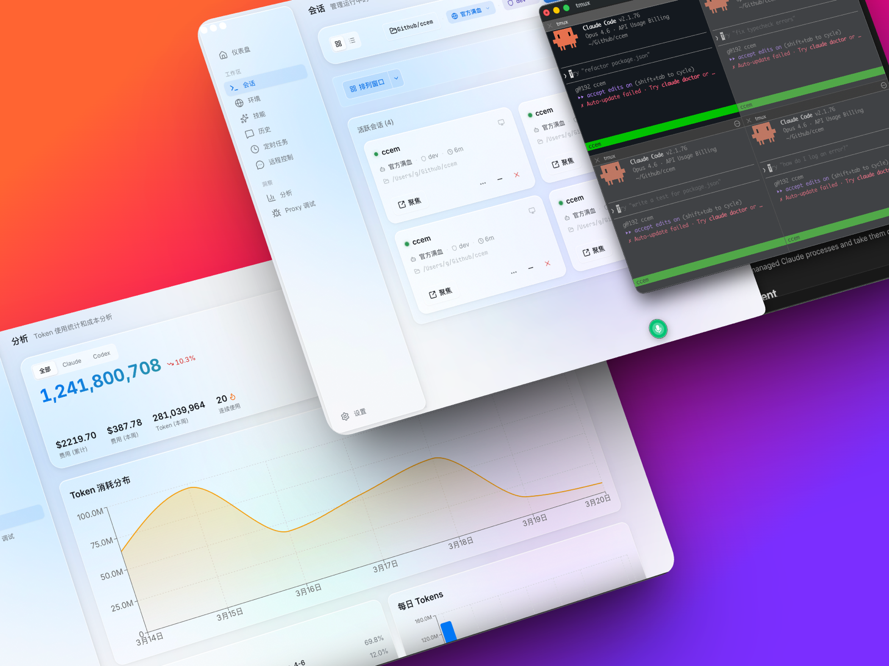
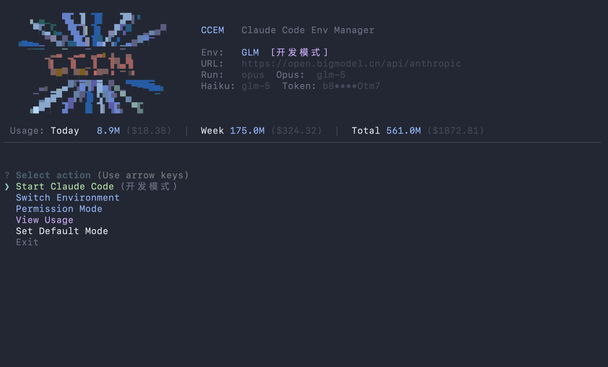
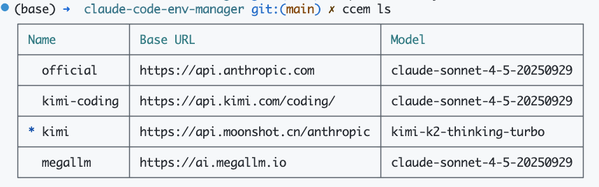
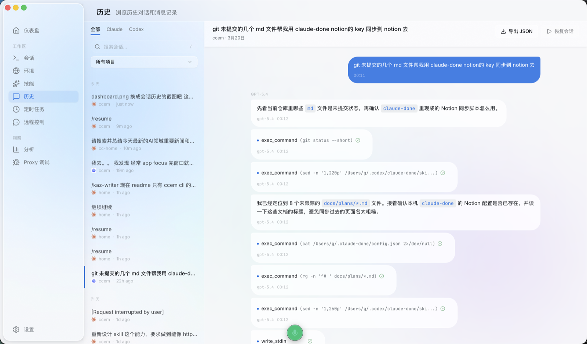
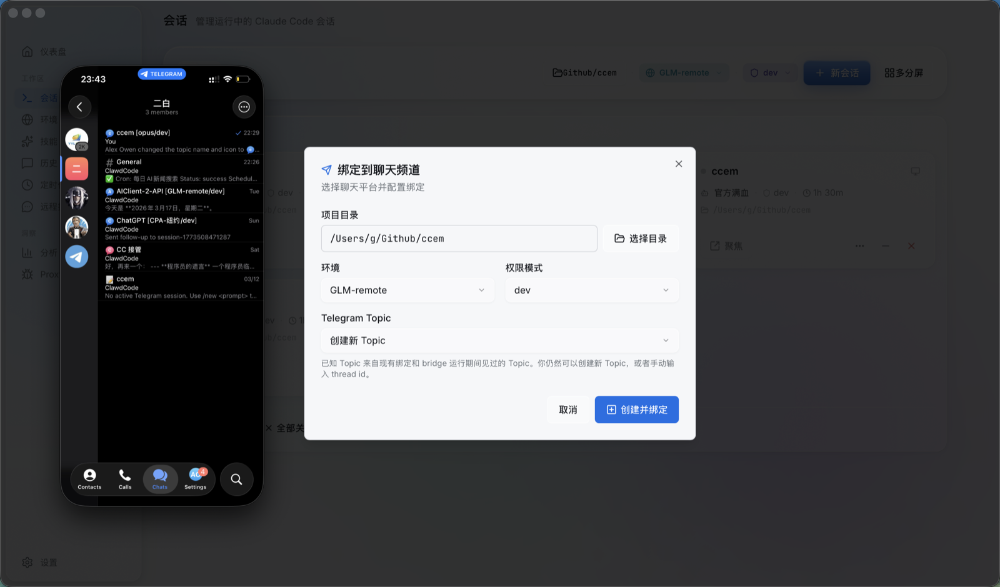
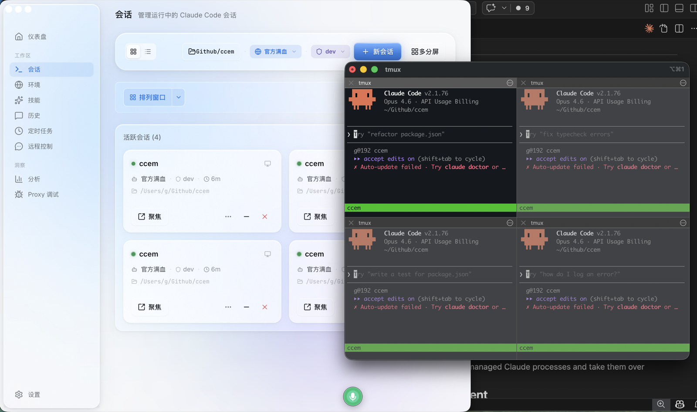
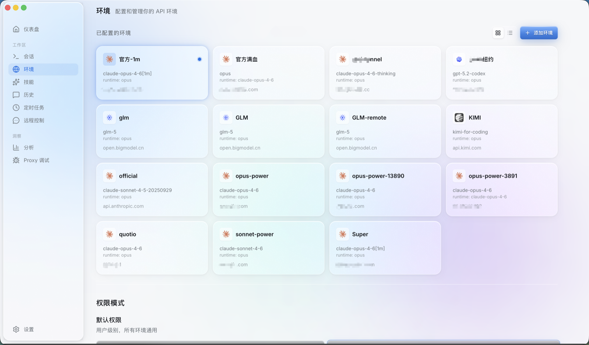
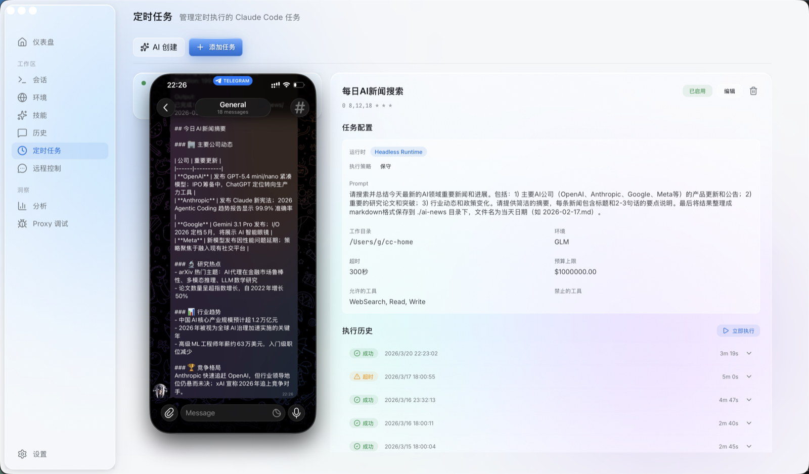
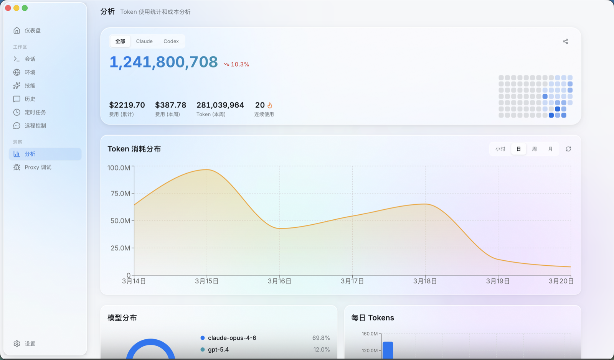

<p align="center">
  
</p>

<h1 align="center">CCEM</h1>
<p align="center">Claude Code & Codex Environment Manager</p>

<p align="center">
  优雅的使用 Claude Code & Codex。
</p>

<p align="center">
  <a href="./README.md">English</a> | <a href="./README_zh.md">中文</a>
</p>

[](https://www.npmjs.com/package/ccem)
[](https://github.com/Genuifx/claude-code-env-manager)
[](https://github.com/Genuifx/claude-code-env-manager/releases)
[](https://github.com/Genuifx/claude-code-env-manager/blob/main/LICENSE)
[](https://github.com/Genuifx/claude-code-env-manager/pulls)



---

## 为什么做这个

说实话，用 Claude Code 用久了，有些事真的挺烦的。

你想用 KIMI 写前端，用 Opus 搞架构，用 DeepSeek 跑脚本。但每次切模型都要手动 `export` 一堆环境变量，切完这个忘了那个，搞到最后终端开了七八个，自己都不记得哪个窗口连的哪个模型。

权限也是。每条命令都要点"允许"，烦。`--dangerously-skip-permissions` 又太放飞，万一把 `.env` 删了呢。

然后你想看看这个月到底花了多少钱。Claude Code 不告诉你，Codex 也不告诉你。两边加起来到底烧了多少？不知道。

最离谱的是——你出门了，突然想让 Claude 帮你改个东西。电脑在家里跑着，你在外面干瞪眼。

还有，每晚想让 Claude 自动跑一遍测试、Review 一下 PR，跑完把结果发到手机上。这个需求不过分吧？但就是没有现成的工具干这事。

所以我做了 ccem。

环境切换、权限管理、多模型并行、用量统计、定时任务、手机远程控制——一个工具全搞定。

两种形态，看你喜欢哪种：

| | CLI | Desktop App |
|--|-----|-------------|
| 适合 | 终端党，脚本自动化 | 想要图形界面，想要更多功能 |
| 环境管理 | ✅ | ✅ |
| 权限模式 | ✅ | ✅ |
| 用量统计 | ✅ | ✅ 热力图 + 趋势图 |
| Skill 管理 | ✅ | ✅ 流式搜索 |
| Claude Code + Codex 双引擎 | — | ✅ |
| Telegram 远程控制 | — | ✅ |
| 微信远程控制 | — | ✅ |
| 定时任务 | — | ✅ |
| 对话历史浏览 | — | ✅ |
| API 请求调试 | — | ✅ |

两边共享同一份配置（`~/.ccem/config.json`），Desktop 改了环境 CLI 立刻生效，反过来也一样。

---

# CLI

终端里搞定环境切换、权限管理、用量统计、Skill 安装。

## 安装

```bash
npm install -g ccem
# 或
pnpm add -g ccem
# 或直接跑
npx ccem
```

## 快速上手

```bash
ccem              # 进入交互菜单
ccem add kimi     # 添加 KIMI 环境，自动填好 URL 和模型
ccem use kimi     # 切换到 KIMI
ccem dev          # 用开发模式启动 Claude Code
ccem usage        # 看 token 用量和花费
ccem skill add    # 交互式安装 Skill
```





## 环境管理

### 内置预设

添加环境时选预设，URL 和模型帮你填好：

| 预设 | Base URL | 主模型 | 快速模型 |
|------|----------|--------|----------|
| GLM（智谱） | `https://open.bigmodel.cn/api/anthropic` | glm-4.6 | glm-4.5-air |
| KIMI（月之暗面） | `https://api.moonshot.cn/anthropic` | kimi-k2-thinking-turbo | kimi-k2-turbo-preview |
| MiniMax | `https://api.minimaxi.com/anthropic` | MiniMax-M2 | MiniMax-M2 |
| DeepSeek | `https://api.deepseek.com/anthropic` | deepseek-chat | deepseek-chat |

> 官方环境默认 `claude-sonnet-4-5-20250929` + `claude-haiku-4-5-20251001`

### 命令

```bash
ccem ls              # 列出所有环境
ccem use <name>      # 切换环境
ccem add <name>      # 添加环境
ccem del <name>      # 删除（official 删不掉）
ccem rename <a> <b>  # 重命名
ccem cp <src> <dst>  # 复制
ccem current         # 当前环境
ccem env             # 输出 export 命令，配合 eval 用
ccem env --json      # JSON 格式
ccem run <cmd>       # 带着环境变量跑命令
```

### Shell 集成

`ccem use` 切换后当前终端环境变量不会自动更新。加这段到 `~/.zshrc`：

```bash
ccem() {
  command ccem "$@"
  local exit_code=$?
  if [[ $exit_code -eq 0 ]]; then
    if [[ "$1" == "use" || -z "$1" ]]; then
      eval "$(command ccem env)"
    fi
  fi
  return $exit_code
}
```

加完 `source ~/.zshrc` 一下。

## 权限模式

6 种预设，在"什么都要确认"和"什么都不管"之间找个平衡。

| 模式 | 说明 | 什么时候用 |
|------|------|------------|
| yolo | 全部放开 | 自己的项目，完全信任 |
| dev | 开发权限，屏蔽敏感文件 | 日常开发 |
| readonly | 只读 | 看代码、学习 |
| safe | 限制网络和修改 | 不熟的代码库 |
| ci | CI/CD 用 | 自动化流程 |
| audit | 只读 + 搜索 | 安全审计 |

### 临时模式（退出即还原）

```bash
ccem yolo / dev / readonly / safe / ci / audit
```

### 永久模式（写入配置）

```bash
ccem setup perms --dev        # 永久应用
ccem setup perms --reset      # 重置
ccem setup default-mode --dev # 设默认
```

### 查看

```bash
ccem --mode        # 当前模式
ccem --list-modes  # 所有模式
```

<details>
<summary><b>dev 模式具体允许/禁止什么</b></summary>

**允许：** Read、Edit、Write、Glob、Grep、LSP、NotebookEdit、npm/pnpm/yarn/bun/node/npx/git/tsc/tsx、eslint/prettier/jest/vitest、cargo/python/go/make、ls/cat/head/tail/find/wc/mkdir/cp/mv/touch、WebSearch

**禁止：** .env/.env.*/secrets/*.pem/*.key/*credential*、rm -rf/sudo/chmod/chown

</details>

<details>
<summary><b>safe 模式具体允许/禁止什么</b></summary>

**允许：** Read、Glob、Grep、LSP、git status/log/diff、ls/cat/head/tail/find/wc

**禁止：** .env/secrets/*.pem/*.key/*credential*/*password*、Edit/Write/NotebookEdit、curl/wget/ssh/scp/WebFetch、rm/mv

</details>

## 用量统计

```bash
ccem usage          # 交互式，带日历热力图
ccem usage --json   # 机器可读
```

读 `~/.claude/projects/` 下的 JSONL 日志，算 token 用量和费用。价格数据从 LiteLLM 拉取并缓存。

## Skill 管理

```bash
ccem skill add              # 交互选择（Tab 切换分组）
ccem skill add <name>       # 装预设
ccem skill add <github-url> # 从 GitHub 装
ccem skill ls               # 列出已装
ccem skill rm <name>        # 删掉
```

<details>
<summary><b>预设 Skill 列表</b></summary>

**官方：** frontend-design、skill-creator、web-artifacts-builder、canvas-design、algorithmic-art、theme-factory、mcp-builder、webapp-testing、pdf/docx/pptx/xlsx、brand-guidelines、doc-coauthoring

**精选：** superpowers（Plan 模式升级版）、ui-ux-pro-max（专业 UI/UX 设计）、Humanizer-zh（去 AI 痕迹）

</details>

## 远程配置

团队共享 API 配置，加密传输：

```bash
ccem load https://your-server.com/api/env?key=YOUR_KEY --secret YOUR_SECRET
```

<details>
<summary><b>服务端部署</b></summary>

服务端代码在 `server/` 目录。配置 `keys.json`（访问密钥）和 `environments.json`（环境变量），跑 `node index.js` 启动。AES-256-CBC 加密、Rate Limiting、热加载。生产环境推荐 PM2。

</details>

## 初始化

```bash
ccem setup init
```

跳过新手引导 + 禁用遥测 + 装 chrome-devtools MCP。

## CLI 命令速查

<details>
<summary><b>展开完整列表</b></summary>

| 命令 | 说明 |
|------|------|
| `ccem` | 交互菜单 |
| `ccem ls` | 列出环境 |
| `ccem use <name>` | 切换 |
| `ccem add <name>` | 添加 |
| `ccem del <name>` | 删除 |
| `ccem rename <a> <b>` | 重命名 |
| `ccem cp <src> <dst>` | 复制 |
| `ccem current` | 当前环境 |
| `ccem env [--json]` | 输出环境变量 |
| `ccem run <cmd>` | 带环境跑命令 |
| `ccem load <url>` | 远程加载 |
| `ccem yolo/dev/readonly/safe/ci/audit` | 临时权限模式 |
| `ccem --mode` | 当前模式 |
| `ccem --list-modes` | 所有模式 |
| `ccem setup perms --<mode>` | 永久权限 |
| `ccem setup default-mode --<mode>` | 默认模式 |
| `ccem setup init` | 初始化 |
| `ccem usage [--json]` | 用量统计 |
| `ccem skill add/ls/rm` | Skill 管理 |

</details>

---

# Desktop App

Tauri 2.0 构建的原生桌面应用。macOS 毛玻璃效果，不是套壳浏览器。

除了 CLI 有的功能之外，Desktop 还有几个独有能力——双引擎、远程控制、定时任务、对话历史、请求调试。

## 安装

从 [GitHub Releases](https://github.com/genuifx/claude-code-env-manager/releases) 下载 `.dmg`，拖进 Applications。

> macOS 10.15 Catalina 及以上。

## Claude Code + Codex 双引擎

<!-- TODO: History 页面截图，显示 Claude/Codex 两种对话 -->


这可能是你最想要的功能之一。

Desktop 同时支持 **Claude Code** 和 **OpenAI Codex CLI** 两个运行时。Dashboard 的启动面板有个下拉菜单，选 Claude 还是 Codex，点一下就跑。

选 Claude 的时候，环境切换和权限模式照常用。选 Codex 的时候，这些概念自动隐藏——Codex 有自己的一套，不需要 ccem 的环境配置。

两种会话统一管理，在 Sessions 页面并排显示，各自带着正确的图标和状态。Proxy Debug 也同时支持两个引擎的 API 流量抓取。

说白了，ccem Desktop 不只是 Claude Code 的管理器，它是你本地 AI 编程助手的控制台。

## Telegram 远程控制

<!-- TODO: ChatApp / Telegram 面板截图 -->


在手机上控制你电脑里跑着的 Claude Code 会话。

和官方 Claude 移动端不同——官方只支持 Anthropic 订阅账号，ccem 用的是你自己配置的 API Key。你在 ccem 里配了什么环境，Telegram 里就能用什么环境。自己的 Key、第三方供应商的 Key，都行。

核心机制是 Telegram 的 Forum Topic。每个 Topic 绑定你电脑上的一个项目目录——一个 Topic，一个项目，一个持久会话。"后端" Topic 连你的后端仓库，"前端" Topic 连你的前端仓库。互不干扰，干干净净。

具体流程：

1. **配置 Bot**：在 ChatApp 页面填入你的 Telegram Bot Token 和允许的用户 ID
2. **绑定项目**：把每个 Forum Topic 映射到本地项目目录，各自设置环境和权限模式
3. **发消息就是发指令**：在手机上给对应 Topic 发消息，ccem 会在本地启动（或复用）一个 Claude Code 会话，把你的消息转发过去
4. **结果回传**：Claude 的回复实时推送回 Telegram，可以选择是否显示 tool calls

出门在外突然想让 Claude 跑个任务，掏出手机就行。

<details>
<summary><b>怎么创建 Telegram Bot</b></summary>

1. 打开 Telegram，搜索 **@BotFather**
2. 发送 `/newbot`，按提示给 Bot 起个名字和用户名
3. BotFather 会回复一个 **Bot Token**（长这样 `123456:ABC-DEF...`）——复制下来
4. 创建一个 Telegram 群组，进群设置，打开 **Topics**（这样群组就变成 Forum 模式了）
5. 把 Bot 拉进群，设为 **管理员**（不然它没法在 Topic 里收发消息）
6. 获取 **Chat ID** —— 在群里发条消息，然后访问 `https://api.telegram.org/bot<你的TOKEN>/getUpdates`，找到 `"chat":{"id":-100xxxxxxxxxx}` 那个数字
7. 获取 **User ID** —— 给 @userinfobot 发条消息，或者在上面 getUpdates 的返回里找 `"from":{"id":...}`
8. 把 Bot Token、Chat ID、User ID 填到 ccem 的 ChatApp → Telegram 设置里就行了

</details>

> 飞书集成正在开发中。

## 微信远程控制

没有 Telegram？没关系，微信也能用。

说实话这个功能我自己等了很久。Telegram 虽然好用，但毕竟不是所有人都装了。微信嘛，谁手机里没有。

和 Telegram 的 Forum Topic 机制不同，微信走的是私聊模式。你用微信给 Bot 发一条消息，ccem 就在本地起一个 headless Claude Code 会话，跑完把结果发回来。简单粗暴。

配置流程：

1. **扫码登录**：在 Desktop 的 ChatApp → 微信面板里点"扫码登录"，用微信扫一下就行
2. **设置白名单**：填上允许控制的微信 ID，不填就是私聊全开放（建议填上）
3. **发消息就是发指令**：在微信里给 Bot 发消息，ccem 自动创建会话并执行
4. **结果回传**：Claude 的输出实时推回微信私聊

权限审批也支持——Claude 需要你批准某个操作时，微信里会收到提示，回复 `/approve` 或 `/deny` 就行。

和 Telegram 一样，Cron 任务跑完的结果也能推到微信。早上醒来看一眼微信，昨晚的 PR Review 结果已经躺在那了。

## 会话管理 — 多模型同时跑

<!-- TODO: Sessions 页面截图 -->


这是 ccem 和 [ccswitch](https://github.com/yibie/ccswitch) 这类工具最大的区别。ccswitch 切的是全局环境——同一时间只能用一个模型。ccem 可以同时跑多个会话，每个会话用不同的模型。

窗口 A 跑 Opus 做架构设计，窗口 B 跑 Gemini 写前端，窗口 C 跑 DeepSeek 写脚本。同时进行，各自独立的环境和权限模式。

- 网格 / 列表视图切换
- 每个会话显示项目目录、环境、权限模式、PID、来源（Desktop / CLI / Telegram / Cron）
- 单个会话：聚焦、最小化、停止、关闭
- 多窗口排列：tmux 模式下一键平铺
- 孤儿会话恢复：检测到没被 ccem 管理的 Claude 进程，可以接管

## 环境管理

<!-- TODO: Environments 页面截图 -->


和 CLI 共享配置，可视化操作：

- 卡片式环境列表，添加 / 编辑 / 删除
- 内置预设一键填充
- 远程配置同步
- 权限模式切换和默认模式设置

## 定时任务 — 自动执行 + 结果推送

<!-- TODO: Cron Tasks 页面截图 -->


写好 cron 表达式和 prompt，ccem 按计划自动跑 Claude Code 任务——跑完结果直接推到你的 Telegram。

这是整个 Desktop 里最爽的组合：Cron + ChatApp。设一个每晚自动 Review PR 的任务，或者每天跑一遍测试，每周做一次安全审计。跑完之后，结果自动发到你绑定的 Telegram Topic 里。早上起来看一眼手机，活干完了。不用守在电脑前等。

你可以把它理解成一个跑在自己电脑上的 [OpenClaw](https://openclaw.com)——定时 AI 编程任务 + 实时通知，数据全在本地。

- **模板**：PR Review、Test Runner、文档生成、安全审计、Changelog，选一个改改就能用
- **AI 生成**：用自然语言描述你想做什么，自动生成 cron 表达式和 prompt
- **结果自动推送**：任务完成（或失败）后，结果自动发到绑定的 Telegram Topic
- **运行历史**：每次执行的状态、耗时、日志都有
- **下次运行预览**：看看接下来几次什么时候跑
- **失败重试**：跑挂了一键重来

## 数据分析 — Claude Code 和 Codex 一起看

<!-- TODO: Analytics 页面截图，显示热力图 -->


GitHub 风格的使用统计，Claude Code 和 Codex 的数据统一在一个面板里。

一键切换 Claude / Codex / 全部视图。终于不用在两个工具之间来回翻，就能看到你总共在 AI 编程上花了多少钱。

- 每日活跃热力图
- Token 用量 / 费用趋势，按模型分类
- 连续使用天数
- 趋势箭头（和上周比是涨还是跌）
- 分享海报：一键生成你的 AI Coding 周报

## 对话历史 — Claude Code 和 Codex 都在这

浏览所有过往的 Claude Code 和 Codex 对话，不用再去翻各自的日志目录了。

- 按来源筛选：全部 / Claude / Codex
- 按项目目录分组
- 支持 `/compact` 分段边界

## Proxy Debug

内置 API 请求调试面板：

- 实时流量列表：时间戳、方法、URL、状态码、大小
- 请求/响应详情查看，JSON 格式化 + SSE 流检测
- 同时支持 Claude 和 Codex 的上游地址配置

## Skill 管理

和 CLI 功能一样，但体验不同：

- **Discover**：流式搜索，边打字边出结果，一键安装
- **Installed**：已装列表，一键卸载

## 设置

- 主题：亮色 / 暗色 / 跟随系统
- 语言：中文 / English
- 默认权限模式 / 默认工作目录
- 终端偏好（iTerm2 / Terminal.app）
- AI 增强模式：用选定环境驱动 AI 功能（比如 cron 任务的自然语言生成）
- 依赖检测：自动检查 ccem CLI / claude / codex / tmux 是否装好

## 快捷键

| 快捷键 | 功能 |
|--------|------|
| Cmd+1~9 | 切换页面 |
| Cmd+Enter / Cmd+N | 启动 Claude Code |
| Cmd+, | 设置 |
| Cmd+Q | 退出 |

---

# 数据存在哪

| 路径 | 内容 |
|------|------|
| `~/.ccem/config.json` | 环境配置（API Key 加密存储） |
| `~/.ccem/usage-cache.json` | 用量缓存 |
| `~/.ccem/model-prices.json` | 价格缓存 |
| `.claude/settings.json` | 项目权限配置 |
| `.claude/skills/` | 已装的 Skills |

---

# 技术栈

```
apps/cli/          # CLI — commander + inquirer + ink
apps/desktop/      # Desktop — Tauri 2.0 + React + Rust
packages/core/     # 共享逻辑 — presets、types、encryption
server/            # 远程配置服务器
```

pnpm workspaces monorepo。

**CLI**：Commander.js、Inquirer.js、Ink（React for CLI）、Conf

**Desktop 前端**：React 18、TypeScript、Vite、Tailwind CSS、Zustand、shadcn/ui、Recharts

**Desktop 后端**：Rust + Tauri 2.0、window-vibrancy（macOS 原生毛玻璃）

**i18n**：中文 / English 双语

---

## Contributing

欢迎提 Issue 和 PR。

## License

MIT
