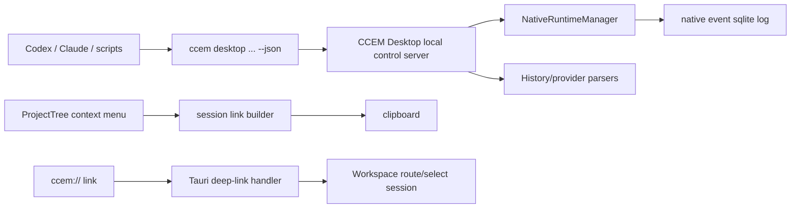

# CCEM External Control and Session Links Research

日期：2026-06-21

## 结论先行

CCEM 需要的是三层能力，而不是单一协议：

1. **外部控制面**：让 Codex、脚本和其他本地工具可以在指定目录新开 CCEM Workspace 任务、查询状态、读取事件、继续输入。
2. **可定位链接**：`ccem://...` 用来把人带回 CCEM Desktop 的 Workspace，并准确定位到某个 live runtime 或 provider 历史会话。
3. **可选兼容协议**：ACP 适合将 CCEM 做成“可被编辑器承载的 agent”或“统一接入多 agent 的 client”，但不适合作为第一版外部调用控制面的核心。

推荐路线：

- 第一优先：实现 **本地 loopback JSON-RPC/HTTP control server + `ccem desktop ... --json` CLI wrapper**。
- 同期：实现 **ProjectTree 右键菜单 + `ccem://workspace/session?...` deep link**。
- 后续：如果目标是让 Zed/JetBrains 这类 ACP Client 导入或驱动 CCEM 管理的会话，再做 **ACP adapter**。
- 不单独做 MCP server；除非未来有明确的“一键安装 CCEM 工具到 agent MCP 配置”的产品目标，否则 `ccem desktop ... --json` 已经足够作为 agent/脚本入口。

## 当前 CCEM 里已经有的基础

### Native session 控制内核

Desktop 后端已经有 Tauri IPC：

- `create_native_session`
- `list_native_sessions`
- `send_native_session_input`
- `get_native_session_events`
- `stop_native_session`

对应前端类型在 `apps/desktop/src/lib/tauri-ipc.ts`。`create_native_session` 已支持：

- provider: `claude | codex`
- envName
- permMode / runtimePermMode
- workingDir
- initialPrompt / initialDisplayPrompt / initialImages
- providerSessionId
- effort

Rust 端 `NativeRuntimeManager::create_session` 已经生成 `runtime_id`、写入 record、追加 lifecycle/user-prompt event、启动 native helper。`list_sessions` 返回 summary，`replay_events_limited` 优先从 sqlite event log 读历史，再 fallback live handle。

所以“外部新建任务、查询进度”不需要重新设计调度器，真正缺的是把这套能力从 **Tauri IPC 内部面**变成 **受控的本机外部面**。

### 两类会话 ID 必须区分

当前会话体系有两个 ID 概念：

- `runtime_id`：CCEM 自己生成，最适合查询 live 状态、event stream、停止/继续输入。
- `provider_session_id`：Codex/Claude 自己的会话 ID，最适合回到 provider 历史内容、继续历史会话。

ProjectTree 现在为了侧边栏体验，会把 live session 的显示 ID 设成：

```ts
provider_session_id || runtime_id
```

这对 UI 没问题，但对链接和外部 API 不够明确。`ccem://` 和外部 API 都应携带 `idKind`，至少支持：

- `idKind=runtime`
- `idKind=provider`
- `source=codex|claude|opencode`

否则复制出来的“会话 ID”将来会出现歧义。

### 历史内容读取已经存在

`history.rs` 已有：

- `get_conversation_history(source?)`
- `get_conversation_messages(session_id, source?)`

它会读取 Claude/Codex/OpenCode 的 provider 历史。也就是说：

- 查询运行进度：走 `runtime_id -> native event log`
- 查询历史内容：走 `provider_session_id + source -> provider history parser`

两者应在外部 API 里分开，不要混成一个“session content”接口。

### 不应复用 Proxy Debug HTTP port

`proxy_debug.rs` 的 HTTP server 是给模型 API 代理和流量记录用的：

- 监听 `127.0.0.1`
- 路径形如 `/proxy/{client}/{route_id}`
- 负责 upstream 请求、body 记录、proxy state

它不是控制面。把“新开任务/查询状态”塞进这个端口会让安全边界和职责混乱。外部控制面应该独立命名、独立 token、独立开关。

## ACP 是否合适

### ACP 的定位

ACP 官方定位是“代码编辑器/IDE 与 coding agent 的通信协议”。本地场景下，典型模式是 client 启动 agent subprocess，并通过 stdio JSON-RPC 通信；远程 HTTP/WebSocket 支持仍在推进中。

ACP 的标准 session 能力包括：

- `session/new`
- `session/prompt`
- `session/list`
- `session/load`
- `session/resume`
- `session/cancel`
- `session/close`

它的 `session/list` 可以按 cwd 发现 session，但官方也明确它是 discovery，不负责恢复或修改会话；恢复要走 `session/load`。

### 和 CCEM 当前需求的错位

这次需求是：

- Codex 或外部脚本直接调用 CCEM
- 指定目录新开 CCEM Workspace 任务
- 查询任务进度
- 复制并打开 `ccem://` 链接定位到 CCEM Desktop 会话

这更像“CCEM Desktop 暴露本地控制面”，而不是“编辑器承载某个 agent”。如果第一版直接用 ACP，会遇到几个错位：

- ACP 默认角色是 **Client 启动 Agent**；CCEM Desktop 是长期运行的本地 app。
- ACP stdio 很适合编辑器拉起 agent server，不适合脚本查询一个已运行 Desktop app 的状态。
- ACP 的 Streamable HTTP 仍是 draft，作为核心本地控制协议风险偏高。
- `ccem://` 打开 UI 是 app deep-link，不是 ACP 的标准职责。
- CCEM 还需要暴露 `runtime_id`、provider session mapping、event replay、open UI 这些 CCEM 特有语义，最终仍需要 `_meta` 或自定义方法。

### ACP 适合的后续位置

ACP 仍然值得保留为后续兼容层，尤其是两类场景：

1. **CCEM 作为 ACP Client**
   - CCEM Workspace 用同一套 client 协议接入 Claude/Codex/OpenCode 等 agent。
   - 这会统一 agent 接入方式，但会改动 native runtime 层，工程量较大。

2. **CCEM 作为 ACP Agent/Facade**
   - Zed/JetBrains 等 ACP Client 可以通过 `ccem-acp-agent` 查看或启动 CCEM 管理的任务。
   - 标准方法映射：
     - `session/new` -> CCEM `create_native_session`
     - `session/list` -> CCEM session/history list
     - `session/load` -> provider history replay
     - `session/prompt` -> `send_native_session_input`
   - CCEM 特有能力放到 `_meta` 或自定义 `_ccem/openSession`、`_ccem/getRuntimeEvents`。

我的判断：ACP 是“外部编辑器集成层”，不是“第一版本机控制面”。

## 推荐架构



### Layer 1: Local control server

独立于 proxy debug，新增一个 Desktop 内部 control server：

- 只绑定 `127.0.0.1`
- 随机端口
- 随机 bearer token
- 端口和 token 写入 `~/.ccem/control.json`
- 文件权限限制为 owner-only
- Desktop 退出时清理或标记过期
- 默认可以先 opt-in，成熟后再按设置启用

建议协议：JSON-RPC over HTTP。

基础方法：

- `ccem.health`
- `ccem.workspace.createSession`
- `ccem.workspace.listSessions`
- `ccem.workspace.getSession`
- `ccem.workspace.getEvents`
- `ccem.workspace.sendInput`
- `ccem.workspace.stopSession`
- `ccem.workspace.resolveSessionLink`
- `ccem.workspace.openSession`

`createSession` 入参应基本对齐现有 `create_native_session`，但外部 API 的字段命名要稳定：

```json
{
  "provider": "codex",
  "cwd": "/Users/wzt/G/Github/claude-code-env-manager",
  "prompt": "run the task",
  "envName": "default",
  "permissionMode": "dev",
  "runtimePermissionMode": null,
  "providerSessionId": null,
  "effort": "medium",
  "open": true
}
```

返回：

```json
{
  "runtimeId": "rt_...",
  "provider": "codex",
  "providerSessionId": null,
  "cwd": "/abs/path",
  "status": "initializing",
  "link": "ccem://workspace/session?source=codex&idKind=runtime&id=rt_..."
}
```

### Layer 2: CLI wrapper

新增 CLI 命令，给脚本和 agent 一个稳定入口：

```bash
ccem desktop create \
  --provider codex \
  --cwd /abs/project \
  --prompt "..." \
  --env default \
  --perm dev \
  --json

ccem desktop sessions --cwd /abs/project --provider codex --json
ccem desktop status <runtime-id> --json
ccem desktop events <runtime-id> --since 120 --limit 100 --json
ccem desktop send <runtime-id> --text "..." --json
ccem desktop open "ccem://workspace/session?source=codex&idKind=runtime&id=rt_..."
```

CLI 不直接写 Desktop 内部文件，不直接复刻 `NativeRuntimeManager`。它只负责：

- 发现 `~/.ccem/control.json`
- 校验 Desktop 是否在线
- 带 token 调 control server
- 输出机器可读 JSON
- 在 Desktop 未运行时返回清晰错误，或可选 `--launch-app`

### Layer 3: `ccem://` deep link

`ccem://` 应是“打开/定位 UI”的协议，不承载 token，不做写操作。

推荐格式：

```text
ccem://workspace/session?source=codex&idKind=runtime&id=rt_123
ccem://workspace/session?source=codex&idKind=provider&id=abcd&cwd=/abs/project
```

可选字段：

- `runtimeId`
- `providerSessionId`
- `cwd`
- `focus=events|history|live`

解析策略：

1. 严格校验 scheme、host、path、query。
2. 如果 `idKind=runtime`，优先匹配 `list_native_sessions.runtime_id`。
3. 如果 `idKind=provider`，用 `source:id` 查历史；必要时用 provenance mapping 查 `runtime_id`。
4. 找不到时 refresh history + live sessions。
5. 仍找不到时展示“无法找到此会话”的 Workspace 空态，而不是静默失败。

Tauri 需要：

- `tauri-plugin-deep-link`
- `tauri-plugin-single-instance`
- `tauri.conf.json > plugins.deep-link.desktop.schemes = ["ccem"]`

原因：Tauri 文档说明运行中的 app 可用 `onOpenUrl`，启动时用 `getCurrent`；Windows/Linux 没有 single-instance 时，系统会把 deep link 作为新实例 CLI 参数传入。

### Layer 4: ProjectTree 右键菜单

ProjectTree session row 增加 custom context menu：

- 复制会话 ID
- 复制 provider 会话 ID（如果有）
- 复制 CCEM runtime ID（如果有）
- 复制 `ccem://` 链接
- 可选：在终端/外部工具中继续

实现建议：

- 先做 `buildCcemSessionLink(session, liveEntry?)` helper。
- 不在 JSX 行内拼 URL。
- `HistorySessionItem.id` 只能作为“显示会话 ID”，菜单文案要说明是 provider 还是 runtime。
- clipboard 使用现有 `navigator.clipboard.writeText` 模式。
- UI 组件优先用现有 Radix DropdownMenu；如果要真正响应右键位置，可以引入/封装 Radix ContextMenu。

## 安全边界

外部控制面风险明显高于 deep link，必须从第一版就收紧：

- 只监听 loopback。
- POST-only，不允许 GET 触发写操作。
- Bearer token，不把 token 放入 `ccem://`。
- `~/.ccem/control.json` owner-only 权限。
- 输入 schema 校验：cwd 必须 absolute；prompt/image size 有上限；provider/env/permMode allowlist。
- 拒绝非 loopback Host。
- 对 browser-origin 请求做 Origin/Content-Type 检查，降低 CSRF 风险。
- 默认不暴露“批准权限请求”这种高风险动作；如果要做，必须单独 capability gate。
- control server 和 proxy debug server 分离，日志也分离。

## 分阶段实施建议

### Phase 0: ID 和 link 语义定稿

- 定义 `CcemSessionRef`：
  - `source`
  - `id`
  - `idKind`
  - `runtimeId?`
  - `providerSessionId?`
  - `cwd?`
- 定义 `buildCcemSessionLink` / `parseCcemSessionLink`。
- 给 ProjectTree 右键菜单接入复制 ID / link。
- 测试链接编码、provider/runtime ID 判定。

### Phase 1: deep link 打开会话

- 加 deep-link + single-instance 插件。
- app 启动读取 `getCurrent`。
- app 运行中监听 `onOpenUrl`。
- Workspace 支持从 link intent 切换 tab、刷新列表、选择目标 session。
- 找不到目标时给出可恢复状态。

### Phase 2: control server + CLI

- 后端新增 `external_control.rs` 或 `control_server.rs`。
- 复用 `NativeRuntimeManager` 和 `history.rs` 的内部能力。
- CLI 新增 `ccem desktop ... --json`。
- 加集成测试：Desktop control server 方法层、CLI JSON 输出、未运行时错误。

### Phase 3: ACP adapter

- 如果要接 Zed/JetBrains 外部 agent 生态，再实现 `ccem-acp-agent`。
- 标准 ACP 方法映射到 CCEM control API。
- CCEM 特有字段放 `_meta`。
- 不要让 ACP adapter 取代 control server；它应该只是一个兼容入口。

## 需要提前决定的问题

1. control server 默认是否开启？
2. 外部 `createSession` 是否允许自动启动 Desktop？
3. `ccem://` 找不到会话时是否允许只打开项目目录视图？
4. 是否要支持 remote callers？当前建议明确不支持，只做本机 loopback。

## 参考资料

- ACP Introduction: https://agentclientprotocol.com/get-started/introduction
- ACP Architecture: https://agentclientprotocol.com/get-started/architecture
- ACP Session Setup: https://agentclientprotocol.com/protocol/v1/session-setup
- ACP Session List: https://agentclientprotocol.com/protocol/v1/session-list
- ACP Transports: https://agentclientprotocol.com/protocol/v1/transports
- Zed External Agents: https://zed.dev/docs/ai/external-agents
- Tauri Deep Linking: https://v2.tauri.app/plugin/deep-linking/
- Tauri Deep Link JS API: https://v2.tauri.app/reference/javascript/deep-link/
- Tauri Single Instance: https://v2.tauri.app/plugin/single-instance/
